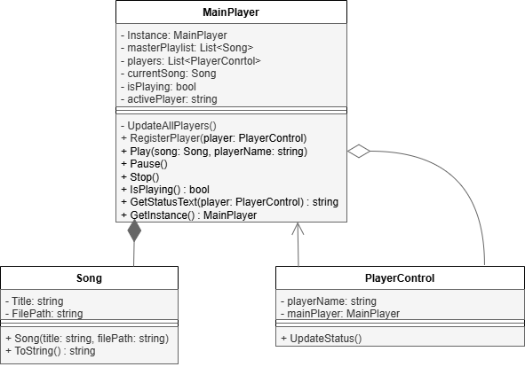

# Лабораторная работа №1
===
Лабораторная работа, в моём случае, подразумевает под собой написание когда с использованием паттерна **Singleton** (Одиночка)

## 1) Предметная область и проблема ##
---
В качестве предметной области был выбран **музыкальный сервис**. Многие музыкальные сервисы существуют на разных платформах и приложения умеют синхронизироваться между собой. Так, например, сервис Spotify может проигрывать музыку только на одном устройстве, при этом управлять плеером можно с другого. Назревает вопрос, как происходит синхронизация данных? Ведь если каждое приложение будет иметь свой плеер, то будет нарушена структура глобальных данных и полностью будет отсутствовать их синхронизация.

## 2) Решение ##
---
Не смотря на возможное множество вариантов решения данной задачи, например, при общении объектов плееров приложения между собой, как описано в варианте решения без паттерна, на мой взгляд лучше всего подойдёт использование некого главного плеера, который будет хранить в себе всю логику проигрывания, а плеерам на устройствах, зависящих от него, остаётся лишь обновлять свои параметры путём обращения к главному плееру и получения от него указаний. С этой задачей прекрасно справляется паттерн **Singleton**.

## 3) Диаграмма классов ##
---
Ниже представленна диаграмма классов. Класс **Song** был создан с целью иметь возможность хранить путь к реальным звуковым файлам для их воспроизведения. С классом **MainPlayer** он имеет связь **композиция** т.к. последний хранит в себе список экземпляров класса Song. Класс **MainPlayer** имеет связь **агрегация** и **ассоциация** с классом **PlayerControl**, т.к. первый хранит в себе коллекцию объектов второго, а второй постоянно хранит в себе ссылку на первый, чтобы иметь возможность обращаться к его публичным методам.

## 4) Вывод ##
---
Решив задачу двумя способами: с использованием паттерна и без, я пришёл к выводу, что использование паттерна **Singleton** делает код значительно чище и читаемее. Была реализована синхронизация данных между плеерами приложений, а так же повысилась защищённость глобальных данных от внешних вмешательств.