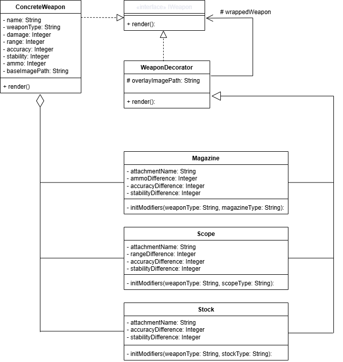
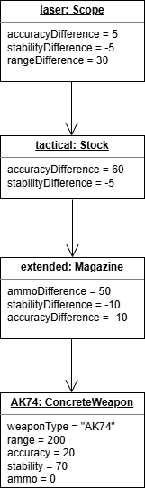

# Лабораторная работа №2
===
## 1) Предметная область и проблема ##
---
В качестве предметной области было выбрано приложение-конструктор, в моём конкретном случае конструктор оружия, однако подобные приложения могут использоваться при конфигурации ПК, авто и т.д. Проблема состоит в том, что при разработке таких приложений появляется надобность делать много разных минорных изменений в объекте, что вызывает затруднения при разработке. Для каждого изменения создавать отдельный класс проблематично, ровно как и предусматривать и обратабывать все изменения внутри одного класса.

## 2) Решение ##
---
Для решения подобных проблем был придуман паттерн **Декоратор**. Он позволяет решить проблему не описанными мной ранее путями, а с помощью класса, который будет "оборачивать объекты в обёртки", тем самым можно будет кратно сократить количество строк кода.

## 3) Диаграммы ##
---

Класс **Weapon** - является интерфейсом для остальных классов
Класс **ConcreteWeapon** - базовый класс для декорирования
Класс **WeaponDecorator** - базовый класс декоратора, который хранит ссылку на декорируемый объект
Остальныые классы: **Magazine**, **Stock**, **Scope** - являются классами-обёртками, используемые декоратором для модификации декорируемого класса

На диаграмме изображены объекты, используемые в программе с их отношениями между собой. В полях указаны только те поля, которые изменяются или используются в процессе декорирования

## 4) Подходы реализации ##
---
Для реализации задачи без паттерна было принято решение динамически изменять единственный класс Weapon в зависимости от того, какие пользователь выбирает модификации для оружия. Я не решился делать много различных классов, ибо это было бы намного более трудозатратным и мне не хватило бы сил полностью повторить функционал решения с паттерном (все вариации оружия).

## 5) Вывод ##
---
После решения задачи двумя разными способами я осознал, что паттерн **Декоратор** очень полезен. Он позволяет не только уменьшать объём работы разботчикам, но так же делает код более приятным, читаемым и простым в дальнейшем развитии. При желании добавить ещё несколько модификаторов для оружия будет куда проще создать новый класс-обёртку, чем динамически применять какой-либо другой из изложенных выше способов решить задачу без использования паттерна