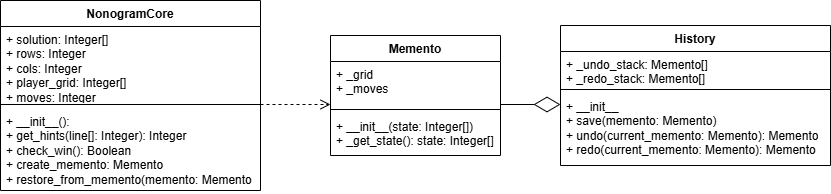

# Лабораторная работа №2
===
## 1) Предметная область и проблема ##
---
В качестве предметной области была выбрана головоломка - нонаграмма, чем-то напоминающая судоку. При неправильных ходах игрок должен иметь возможность отменить действие. В программе это реализовано двумя способами: первый - по средству повторого нажатия на ту же клетку, но тогда игрок не сможет тщательно отследить свои действия, более того количество ходов при таком подходе увеличивается; второй - с помощью отдельной кнопки по отмене действия, она позволяет последовательно откатывать все действия, а вместе с ними и количество шагов. Второй способ, очевидно, намного удобнее, но стоит вопрос о том, как правильно его реализовать, ведь для каждого состояния игрового поля нужно отдельно выделять память.

## 2) Решение ##
---
Для решения подобных проблем был придуман паттерн **Memento**. Он позволяет решить проблему с помощью создания так называемого Caretaker, который по сути является контроллером состояний и хранит в себе экземпляры класса Memento, которые, в свою очередь, хранят в себе состояния игрового поля. Один экземпляр хранит одно состояние

## 3) Диаграммы ##
---

Класс **NongramCore** - является классом, отвечающим за всю логику игры
Класс **History** - вышеупомянутый Caretaker
Класс **Memento** - Виновник торжества, который в каждом экземпляре хранит по состоянию игры

## 4) Подходы реализации ##
---
Для реализации задачи без паттерна было принято решение не создавать класс Memento и хранить все изменения в _undo_stack и _redo_stack в классе History в виде двумерных списков. Первый элемент каждого подсписка содержит состояние игрового поля, второй элемент - состояние количества шагов. С моим примером, где Memento хранит в себе мало данных, этот подход мало чем уступает подходу с паттерном, но в других случаях разница может быть большой.

## 5) Вывод ##
---
После решения задачи двумя разными способами я осознал, что паттерн **Memento** очень полезен. Он делает код более приятным, читаемым и простым в дальнейшем развитии. При разработке крупного проекта, например редактора, где нужно хранить много данных для каждого снапшота, код будет проще масштабировать, ведь будет достаточно добавить лишь новое поле в классе Memento, в то время как в реализации без паттерна придётся писать больше кода, более того, он будет повторяться, ведь методы undo и redo мало чем друг от друга отличаются