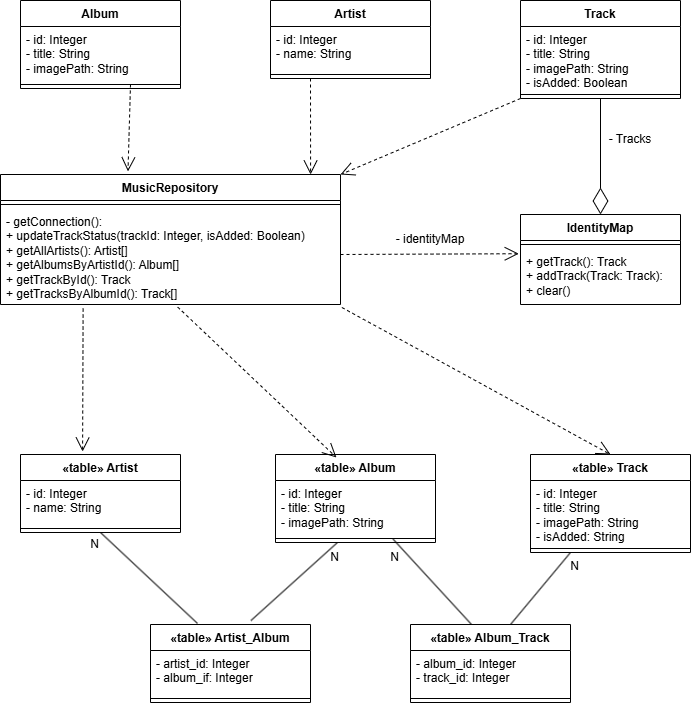

# Лабораторная работа №4

## 1) Предметная область и проблема ##
---
В качестве предметной области был выбран музыкальный сервис. Музыкальные сервисы очень часто обращаются к базам данных, из-за этого нагрузка на них может возрасти, особенно от особо любопытных пользователей, которые любят изучать дискографии артистов и прыгают по их альбомам. Не только нагрузкой на сервер такое поведение чревато. Неграмотное использование памяти, при котором создаются дупликаты объектов с одними и теми же ключами, может очень быстро её засорить, от чего устройство пользователя начнёт тормозить, а сам пользователь, вероятно, откажется от использования вашего сервиса, сославшись на его неоптимизированность. Более того, возникает проблема синхронизации. Ведь если выделять несколько мест в памяти для одного и того же объекта из базы данных, будут возникать проблемы с синхронизацией этого самого объекта между пользователем и сервером, в случае, если объект вообще можно изменять.

## 2) Решение ##
---
Для решения подобных проблем был придуман паттерн **Identity Map**. Он позволяет решить все вышеуказанные проблемы: выделять по одному месту в памяти для каждого загружаемого объекта из бд, снизить количество запросов на саму базу данных и наладить синхронизацию, т.к. изменения этого объекта в одном месте кода отразятся на нём и в другом месте.

## 3) Диаграммы ##
---

Классы **Artist, Album** и **Track** - являются классами, аналогичными таблицам из базы данных **«table» Artist, «table» Album** и **«table» Track** соответственно.
Класс **MusicRepository** - класс, отвечающий за связь всего кода с базой данных, а так же "контроллер" карты объектов, единственный имеющий доступ к ней, а так же напрямую с ней взаимодействующий.
Класс **IdentityMap** - сама карта или коллекция объектов, хранящая в себе id объектов класса **Track** и сами треки для дальнейшего использования

## 4) Подходы реализации ##
---
Для реализации задачи без паттерна было принято решение вырезать класс **IdentityMap** и скинуть весь груз созданных объектов на код, отвечающий за интерфейс, чтобы теперь он хранил данные о созданных объектов. На функционал приложения это не повлияло, но нарушило принцип инкапсуляции и единственной ответственности. Более того, код стал "неповоротливым". Если я захочу расширить функционал приложения, сделать карту не только для треков, то мне понадобится создавать кучу отдельных методов под каждый класс и на все случаи жизни: репозиторий станет ещё более нагруженным и будет иметь больший вес ответственности.

## 5) Выводы ##

Паттерн **Identity Map**, на первый взгляд, может показаться не особо полезным, особенно для небольших проектов, где большая нагрузка на бд невозможна априори, однако, помимо того, что с этим паттерном код будет намного более чистым и легко масштабируемым, карта объектов так же решает некоторые оптимизационные вопросы, как на стороне сервера, так и на стороне клиента.
